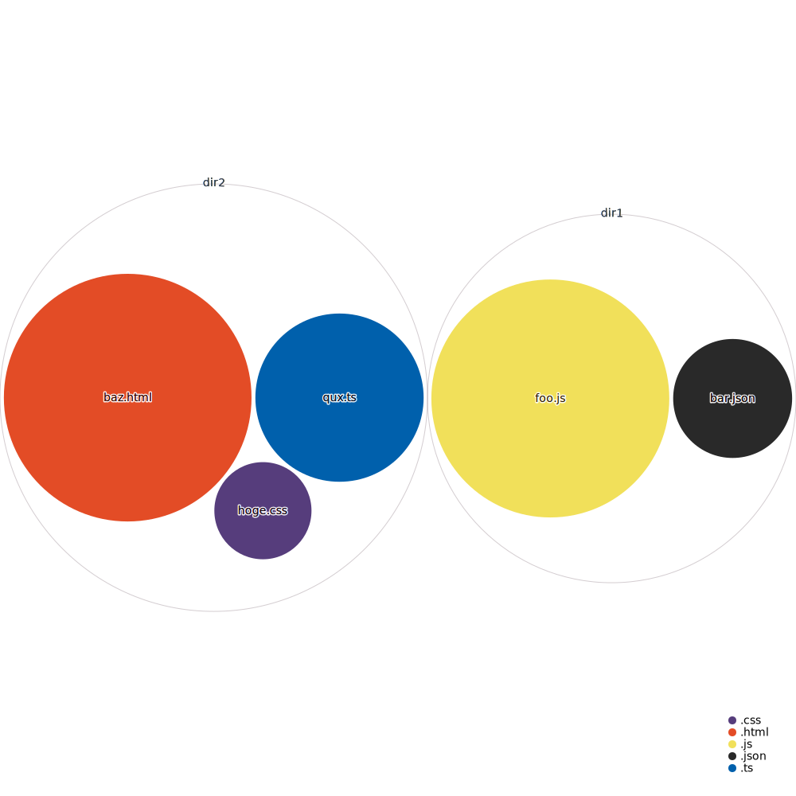

# as-enclosure

as-enclosure is a command line tool that takes a list of file + count pairs,
and visualizes them with an enclosure diagram.

For example,
given:

```
dir1/foo.js:24
dir1/bar.json:5
dir2/qux.ts:12
dir2/hoge.css:3
dir2/baz.html:24
```

it will generate:



The visualization is generated by [repo-visualizer](https://github.com/githubocto/repo-visualizer), and the name of the repo is from [as-tree](https://github.com/jez/as-tree).
